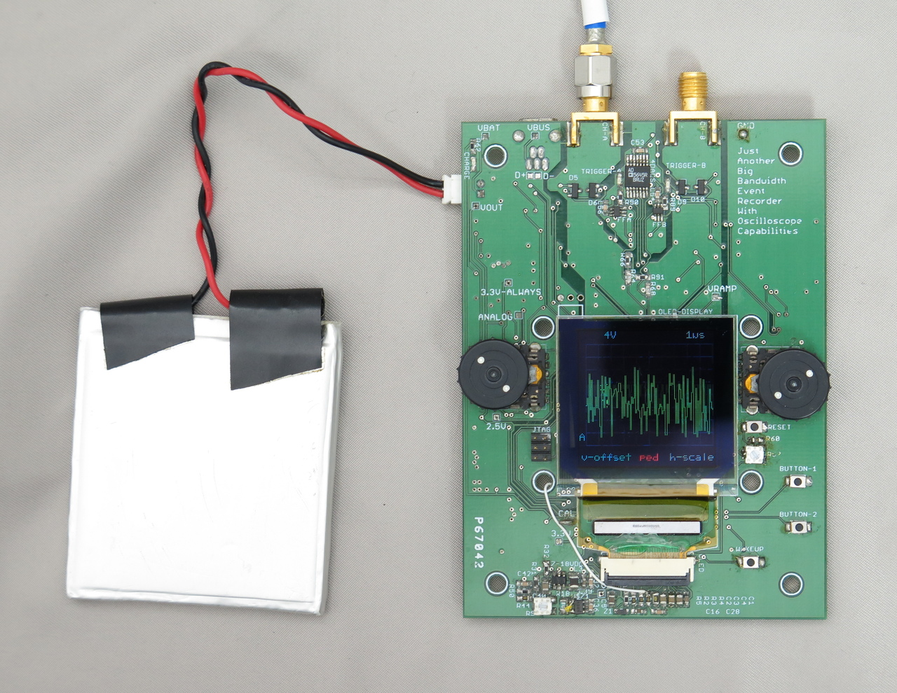
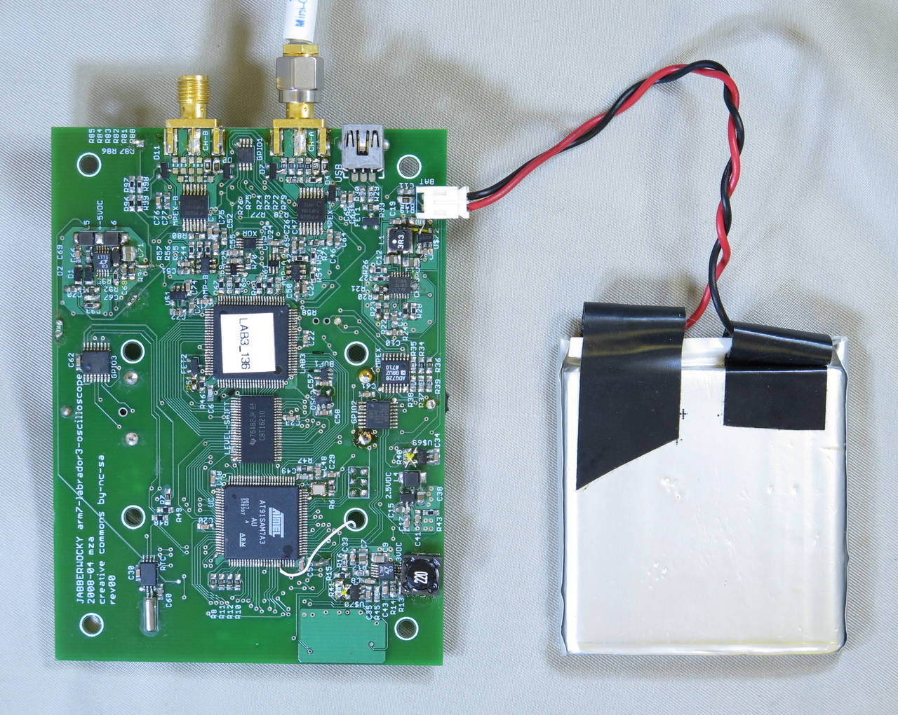

# jabberwocky-oscilloscope
an open-source & open-hardware oscilloscope

Jabberwocky is an acronym for Just Another Big Bandwidth Event Recorder With Oscilloscope Capabilities.

It is a combination of hardware designs and software that uses an ASIC switched-capacitor-array ADC to make a handheld, battery/usb powered, 2 channel oscilloscope with an OLED display.

Development on the oscilloscope was started in January, 2008. A design was finalized and a board was fabricated in May of that year.

# overview

The oscilloscope is battery (rechargable LiPoly) or usb powered, has 2 channels of input (DC coupled only), has a 128×124 pixel full-color OLED display. It supports (slightly) advanced triggering or an optional trigger-delay.

The input impedance of this scope is 1MOhm. The analog bandwidth is unknown at this point (and will be until the project is nearly complete). The lab3 can sample billions of times per second, but this oscilloscope will probably only be useful at a much much lower sampling speed. This is due to the choice of input amplifier and multiplexer: The multiplexer has a bandwidth of about 700MHz as does the voltage-feedback operational amplifier.

# files

[PCB schmatic](jabberwocky-PCB-eagle/jabberwocky.schematic.pdf)

[PCB layout](jabberwocky-PCB-eagle/jabberwocky.layout.pdf)

[PCB gerber files](jabberwocky-PCB-eagle/arm7-oscilloscope-gerbers.zip)

# notes

Automatically exported from code.google.com/p/jabberwocky-oscilloscope
